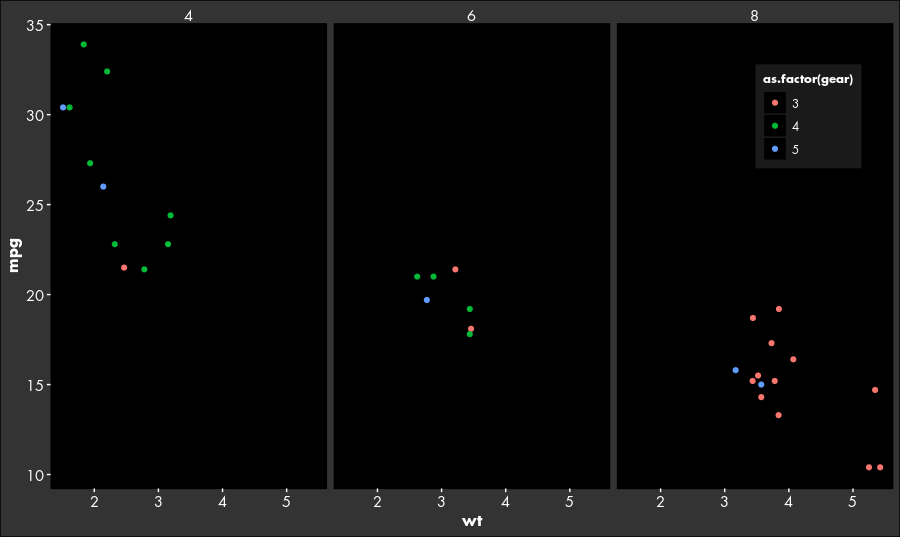
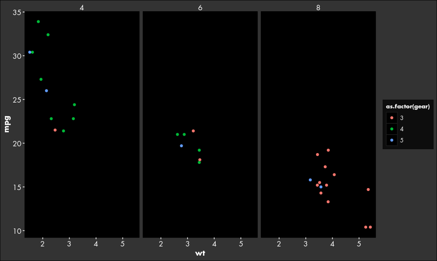

 # Dark themes for ggplot2
 
 `ggplot2` so far offers only little in the way of dark themes for nightowls who are using the dark RStudio theme and spend nights hunched over laptops in poorly lit rooms.
 Here is an attempt, partly influenced by theme_black() from [github.com/jslefche](https://gist.github.com/jslefche/eff85ef06b4705e6efbc).
 It comes in two versions, with the legend inside or outside the plotting area.
 They are called `theme_nightin()` and `theme_nightout()`.
 For `theme_nightin()`, the problem arises as to where to place the legend without covering data.
 You should try and find a suitable location; when in doubt, use `nightout()`.
 `nightin()` is rather intended for when you want to put effort into presentation and an extra large plotting area.
 Pass the location as parameter, `legend.positio = c(x, y)` where "x" ranges from 0 (left) to 1 (right), and y from 0 (bottom) to 1 (top).
 The reference point is the middle of the legend.
 
 Also, I picked *Futura LT* as `base_family`. 
 It's a matter of taste and if you don't have it installed, that should be fine, with ggplot using the default font.
 
 ## Example plots
 
 ```r
 ggplot(mtcars,
       aes(x = wt,
           y = mpg,
           color = as.factor(gear))) +
  geom_point() +
  facet_grid(. ~ as.factor(cyl)) +
  theme_nightin()
```
 
 
 
 ```r
 ggplot(mtcars,
       aes(x = wt,
           y = mpg,
           color = as.factor(gear))) +
  geom_point() +
  facet_grid(. ~ as.factor(cyl)) +
  theme_nightout()
 ```

 
 
 
